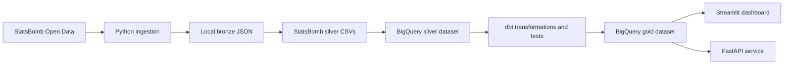

# Football Intelligence Platform

Production-oriented football data engineering platform for ingesting,
modelling, serving, and visualising open football event data.

The completed StatsBomb path runs end to end:

- sample-safe StatsBomb Open Data ingestion to local bronze JSON
- bronze-to-silver normalization into local CSV tables
- BigQuery silver loading with explicit schemas
- dbt gold warehouse modelling and tests
- Streamlit dashboard backed by BigQuery gold tables
- FastAPI service backed by the same BigQuery gold tables

Transfermarkt ingestion/parsing exists as an optional, conservative ingestion
path. Transfermarkt dbt marts are intentionally disabled until those silver
tables are loaded.

## Table of Contents

- [Architecture](#architecture)
- [Tech Stack](#tech-stack)
- [Repository Layout](#repository-layout)
- [Clean Clone Setup](#clean-clone-setup)
- [Environment Variables](#environment-variables)
- [GCP Authentication](#gcp-authentication)
- [End-to-End Sample Pipeline](#end-to-end-sample-pipeline)
- [Docker Usage](#docker-usage)
- [StatsBomb Ingestion](#statsbomb-ingestion)
- [Silver Transformation](#silver-transformation)
- [BigQuery and dbt Warehouse](#bigquery-and-dbt-warehouse)
- [Streamlit Dashboard](#streamlit-dashboard)
- [FastAPI Service](#fastapi-service)
- [Transfermarkt Ingestion](#transfermarkt-ingestion)
- [Terraform and Cloud Infrastructure](#terraform-and-cloud-infrastructure)
- [CI/CD and Tests](#cicd-and-tests)
- [Documentation and Community Links](#documentation-and-community-links)
- [FAQ](#faq)
- [Contributing](#contributing)
- [Issues](#issues)
- [Pull Requests](#pull-requests)
- [Security and Submission Hygiene](#security-and-submission-hygiene)
- [Project Status](#project-status)
- [Future Work](#future-work)

## Architecture

The platform follows a medallion design: raw source-faithful bronze assets,
cleaned silver tables, and analytics-ready gold marts.



## Tech Stack

- Python for ingestion, transformation, loading, API, and dashboard code
- BigQuery for silver and gold warehouse tables
- dbt for gold modelling and warehouse tests
- Streamlit for portfolio-ready analytics views
- FastAPI for clean JSON access to curated football data
- Ruff and pytest for CI-friendly linting and tests
- Docker Compose for local service scaffolding
- Airflow DAG scaffolding for orchestration evolution
- Terraform scaffolding for future cloud infrastructure management

## Repository Layout

```text
.
├── airflow/                  # Airflow DAG skeleton
├── dbt/football_intelligence # dbt project for silver-to-gold modelling
├── docker/                   # Service-specific Dockerfiles
├── docs/                     # Architecture, pipeline, API, dbt, and troubleshooting notes
├── infra/terraform/          # GCS and BigQuery infrastructure skeleton
├── scripts/                  # Local developer and CI helper scripts
├── src/football_intelligence # Python application package
└── tests/                    # Unit tests
```

## Clean Clone Setup

From a clean clone:

```bash
git clone https://github.com/saifrhman/football-analytics-platform.git
cd football-analytics-platform
python3 -m venv .venv
. .venv/bin/activate
python3 -m pip install -e ".[dev]"
cp .env.example .env
```

Edit `.env` with your local and GCP settings, then validate the local codebase:

```bash
make lint
make test
```

## Environment Variables

Use `.env.example` as the source of truth for local configuration. The main
pipeline and apps use:

- `GCP_PROJECT_ID`: Google Cloud project containing BigQuery datasets.
- `GCP_REGION`: BigQuery location, usually `europe-west2`.
- `BIGQUERY_DATASET_SILVER`: BigQuery dataset for loaded silver tables.
- `BIGQUERY_DATASET_GOLD`: BigQuery dataset for dbt-built gold models.
- `GOOGLE_APPLICATION_CREDENTIALS`: optional path to a service account JSON key.
- `LOCAL_BRONZE_DIR`: local raw data root, default `./data/bronze`.
- `LOCAL_SILVER_DIR`: local normalized CSV root, default `./data/silver`.
- `STATSBOMB_*`: StatsBomb source and local sampling filters.
- `TRANSFERMARKT_*`: optional Transfermarkt ingestion configuration.

Do not commit `.env` or credential files.

## GCP Authentication

The recommended local workflow uses Google Application Default
Credentials/OAuth:

```bash
gcloud auth application-default login
```

Service account JSON keys are not required for the recommended local workflow.
If you do use `GOOGLE_APPLICATION_CREDENTIALS`, keep the key file outside Git
and rotate it immediately if it is exposed.

## End-to-End Sample Pipeline

Run the safe StatsBomb sample pipeline first. It limits match processing and is
the recommended local development flow.

```bash
make ingest-statsbomb-sample
make transform-statsbomb-silver-sample
make load-statsbomb-bigquery
make dbt-run
make dbt-test
```

Then start the two user-facing apps:

```bash
streamlit run src/football_intelligence/dashboard/app.py
PYTHONPATH=src uvicorn football_intelligence.api.main:app --reload
```

## Docker Usage

Docker Compose is included for local service scaffolding:

```bash
make build
make up
make logs
make down
```

The core verified development path still runs directly through Python, dbt,
BigQuery, Streamlit, and FastAPI. Docker is present to support deployment and
multi-service local development as the platform matures.

## StatsBomb Ingestion

StatsBomb ingestion writes source-faithful JSON under `./data/bronze` by
default, using object-storage-style paths.

```bash
make ingest-statsbomb-sample
```

The sample target runs:

```bash
python3 -m football_intelligence.ingestion.statsbomb.run \
  --competition-ids 2 \
  --season-ids 44 \
  --match-limit 5 \
  --bronze-dir ./data/bronze
```

`--match-limit` is applied after `--competition-ids`, `--season-ids`, and
`--match-ids`, so local runs stay bounded.

Expected bronze layout:

```text
data/bronze/statsbomb/open-data/
├── competitions/competitions.json
├── matches/competition_id=<id>/season_id=<id>/matches.json
├── events/match_id=<id>/events.json
├── lineups/match_id=<id>/lineups.json
└── three-sixty/match_id=<id>/three-sixty.json
```

Do not run full StatsBomb ingestion as the first local action. Full ingestion
should be reserved for cloud storage, chunked processing, or an intentional
larger-scale run.

## Silver Transformation

The StatsBomb silver transformation reads bronze JSON and writes normalized CSV
tables under `./data/silver/statsbomb`.

```bash
make transform-statsbomb-silver-sample
```

Expected silver output:

```text
data/silver/statsbomb/
├── competitions.csv
├── matches.csv
├── teams.csv
├── players.csv
├── events.csv
├── shots.csv
├── passes.csv
├── pressures.csv
└── three_sixty_freeze_frames.csv
```

## BigQuery and dbt Warehouse

The BigQuery loader writes the silver CSV files into
`BIGQUERY_DATASET_SILVER` using explicit schemas and `WRITE_TRUNCATE` for
development-friendly reloads.

```bash
make load-statsbomb-bigquery
```

dbt reads from the silver dataset and builds analytics-ready gold models into
`BIGQUERY_DATASET_GOLD`. Source and target project/dataset names come from
environment variables, not hardcoded values.

Active gold models:

- dimensions: `dim_competitions`, `dim_matches`, `dim_players`,
  `dim_seasons`, `dim_teams`
- facts: `fact_events`, `fact_passes`, `fact_pressures`, `fact_shots`
- supporting views: `stg_statsbomb_*`, `int_events_enriched`

Disabled until Transfermarkt silver data is loaded:

- `stg_transfermarkt_player_market_values`
- `fact_player_market_values`
- `fact_transfers`

Run:

```bash
make dbt-run
make dbt-test
```

Generate dbt docs:

```bash
make dbt-docs-generate
cd dbt/football_intelligence
dbt docs serve
```

## Streamlit Dashboard

The Streamlit dashboard reads from BigQuery gold tables and provides a
portfolio-ready StatsBomb analytics surface. It includes filters for team,
match, player, and event type.

Dashboard views:

- xG trend and shot xG summary from `fact_shots`
- pass type distribution from `fact_passes`
- shot outcome distribution from `fact_shots`
- pressure count by team/player from `fact_pressures`
- top passers from `fact_passes`

Run:

```bash
streamlit run src/football_intelligence/dashboard/app.py
```

If credentials, permissions, or tables are missing, the dashboard shows a clear
error rather than failing silently.

## FastAPI Service

The FastAPI service reads from the same BigQuery gold tables as the dashboard
and returns clean JSON responses.

Run:

```bash
PYTHONPATH=src uvicorn football_intelligence.api.main:app --reload
```

Endpoints:

- `GET /health`
- `GET /teams`
- `GET /players`
- `GET /matches`
- `GET /analytics/xg-summary`
- `GET /analytics/pass-types`
- `GET /analytics/shot-outcomes`
- `GET /analytics/pressures`

Example requests:

```bash
curl http://127.0.0.1:8000/health
curl "http://127.0.0.1:8000/teams?limit=50"
curl "http://127.0.0.1:8000/players?team_id=1&limit=50"
curl "http://127.0.0.1:8000/matches?team_id=1&limit=25"
curl "http://127.0.0.1:8000/analytics/xg-summary?team_id=1&limit=10"
curl "http://127.0.0.1:8000/analytics/pass-types?match_id=12345"
curl "http://127.0.0.1:8000/analytics/shot-outcomes?player_id=67890"
curl "http://127.0.0.1:8000/analytics/pressures?team_id=1&limit=20"
```

Analytics endpoints support optional `team_id`, `match_id`, `player_id`, and
`limit` query parameters. BigQuery credential, table, and query failures are
returned as clear service errors.

Interactive API documentation is available locally after starting FastAPI:

```text
http://127.0.0.1:8000/docs
```

## Transfermarkt Ingestion

Transfermarkt ingestion is URL-driven and conservative. Configure only the
squad and transfer pages you want to collect, use a descriptive user agent, and
keep a delay between requests.

```bash
make ingest-transfermarkt
```

The parser tests use saved HTML fixtures under `tests/fixtures/transfermarkt`
and do not hit the live website. Transfermarkt dbt marts are disabled until the
corresponding silver tables are loaded.

## Terraform and Cloud Infrastructure

Terraform files under `infra/terraform/` provide infrastructure scaffolding for
GCS and BigQuery resources. They are not presented as a fully production
deployed environment in this repository. Treat them as a starting point for
cloud provisioning work.

Do not commit Terraform state files.

## CI/CD and Tests

The local verification commands are:

```bash
make lint
make test
make dbt-parse
```

Use `make dbt-run` and `make dbt-test` when BigQuery credentials and datasets
are available. Python tests use mocks for BigQuery where possible and do not
require real GCP credentials.

## Documentation and Community Links

Documentation resources:

- Project overview docs: [docs/README.md](docs/README.md)
- Architecture notes: [docs/architecture.md](docs/architecture.md)
- Pipeline operating guide: [docs/pipeline.md](docs/pipeline.md)
- API documentation: [http://127.0.0.1:8000/docs](http://127.0.0.1:8000/docs)
- API notes: [docs/api.md](docs/api.md)
- dbt notes: [docs/dbt.md](docs/dbt.md)
- Troubleshooting: [docs/troubleshooting.md](docs/troubleshooting.md)

dbt docs can be generated with:

```bash
make dbt-docs-generate
```

Serve dbt docs locally with:

```bash
cd dbt/football_intelligence
dbt docs serve
```

## FAQ

### Does this project require paid football data?

No. The verified pipeline uses StatsBomb Open Data. Transfermarkt ingestion is
optional and should be used responsibly.

### Does this project use StatsBomb 360?

Yes. Ingestion and silver transformation support StatsBomb 360 freeze-frame
data when it is available for selected matches.

### Why does the sample pipeline only process five matches?

The five-match limit keeps local development fast, inexpensive, and safe before
scaling to larger cloud or chunked processing.

### Can this project run without GCP?

The ingestion and local silver transformation can run without GCP. BigQuery,
dbt gold builds, the dashboard, and the API require GCP-backed BigQuery tables.

### Why are Transfermarkt dbt models disabled?

The current verified warehouse path is StatsBomb-only. Transfermarkt dbt models
are disabled until Transfermarkt silver tables are loaded into the warehouse.

### Why use BigQuery and dbt?

BigQuery provides a managed analytical warehouse, while dbt gives versioned SQL
models, source definitions, tests, and documentation.

### Why use both Streamlit and FastAPI?

Streamlit provides an analyst-facing dashboard. FastAPI provides clean JSON
endpoints for applications, notebooks, and downstream services.

### Why is Docker included?

Docker provides local service scaffolding and a path toward repeatable runtime
environments, even though the verified local pipeline can run directly in
Python.

### Why are Airflow and Terraform described as scaffolding?

The repo includes initial DAG and infrastructure structure, but orchestration
and cloud provisioning are not claimed as fully production deployed yet.

### How do I report setup issues?

Open a GitHub issue with the command you ran, the full error, your OS, Python
version, workflow type, and relevant logs.

### How do I contribute improvements?

Open a focused pull request with tests and documentation updates where behavior
changes.

## Contributing

Preferred contribution workflow:

1. Fork the repository or branch from `main`.
2. Make a focused change.
3. Keep commits meaningful.
4. Add or update tests.
5. Update README or docs when behavior changes.
6. Open a pull request.
7. Describe what changed and how it was tested.

## Issues

Open issues at:

```text
https://github.com/saifrhman/football-analytics-platform/issues
```

Use issues for:

- bugs
- setup problems
- documentation gaps
- feature requests
- BigQuery/dbt errors
- Docker issues
- dashboard/API problems

When opening an issue, include:

- command you ran
- full error message
- operating system
- Python version
- whether you used local, Docker, or GCP workflow
- relevant logs or screenshots

## Pull Requests

Open pull requests at:

```text
https://github.com/saifrhman/football-analytics-platform/pulls
```

PR checklist:

- create a feature branch
- run `make lint`
- run `make test`
- run `make dbt-parse` if dbt files changed
- run `make dbt-run` and `make dbt-test` if warehouse models changed
- update README/docs if behaviour changes
- do not commit `.env`
- do not commit credentials
- do not commit local data
- do not commit dbt target/log files
- do not commit Terraform state
- put intentional screenshots only under `docs/images/`

## Support

For project-specific problems, open a GitHub issue. For GCP billing or account
problems, check Google Cloud console and billing documentation. For
dbt-specific problems, include dbt command output and compiled SQL if relevant.
For BigQuery query errors, include the job ID if available.

## Security and Submission Hygiene

Do not open public issues containing secrets, API keys, service account keys,
access tokens, or private credentials. If a secret is accidentally committed,
rotate or revoke it immediately.

The project uses Application Default Credentials/OAuth locally. Service account
JSON keys are not required for the recommended local workflow. `.env` and
credential files must stay out of Git.

Do not commit local pipeline outputs, credentials, screenshots, or generated
state unless intentionally placed under a documented path such as
`docs/images`.

Ignored by default:

- `.env` and other local env files
- local `data/`
- service account and credential key patterns
- dbt `target/`, `logs/`, `dbt_packages/`, and `.user.yml`
- Terraform state and local caches
- root-level screenshots

Before submission:

```bash
git status --short
make lint
make test
```

## Project Status

The StatsBomb sample pipeline, BigQuery loading, dbt gold modelling, Streamlit
dashboard, FastAPI service, linting, and Python tests are implemented and
verified. Transfermarkt ingestion/parsing is available as an optional path;
Transfermarkt warehouse marts remain disabled until the corresponding silver
warehouse tables are loaded.

## Future Work

- Add chunked/cloud-native full StatsBomb ingestion.
- Promote Airflow DAGs from placeholders to scheduled production workflows.
- Expand Terraform into complete environment provisioning.
- Add richer dashboard views and screenshots under `docs/images/`.
- Enable Transfermarkt dbt marts after loading Transfermarkt silver tables.
- Add deployment guidance for API and dashboard services.
