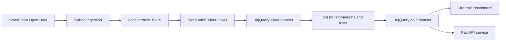

# football-intelligence-platform

Production-oriented football data engineering platform for ingesting,
modelling, serving, and visualising open football event data.

The completed StatsBomb path runs end to end:

- sample-safe StatsBomb Open Data ingestion to local bronze JSON
- bronze-to-silver normalization into local CSV tables
- BigQuery silver loading with explicit schemas
- dbt gold warehouse modelling and tests
- Streamlit dashboard backed by BigQuery gold tables
- FastAPI service backed by the same BigQuery gold tables

Transfermarkt ingestion/parsing exists as an optional, conservative ingestion
path. Transfermarkt dbt marts are intentionally disabled until those silver
tables are loaded.

## Architecture

The platform follows a medallion design: raw source-faithful bronze assets,
cleaned silver tables, and analytics-ready gold marts.



Primary technologies:

- Python for ingestion, transformation, loading, API, and dashboard code
- BigQuery for silver and gold warehouse tables
- dbt for gold modelling and warehouse tests
- Streamlit for portfolio-ready analytics views
- FastAPI for clean JSON access to curated football data
- Ruff and pytest for CI-friendly linting and tests
- Docker Compose, Airflow, and Terraform scaffolding for deployment evolution

## Repository Layout

```text
.
├── airflow/                  # Airflow DAG skeleton
├── dbt/football_intelligence # dbt project for silver-to-gold modelling
├── docker/                   # Service-specific Dockerfiles
├── docs/                     # Architecture and operating notes
├── infra/terraform/          # GCS and BigQuery infrastructure skeleton
├── scripts/                  # Local developer and CI helper scripts
├── src/football_intelligence # Python application package
└── tests/                    # Unit tests
```

## Clean Clone Setup

From a clean clone:

```bash
git clone <repo-url>
cd football-analytics-platform
python3 -m venv .venv
. .venv/bin/activate
python3 -m pip install -e ".[dev]"
cp .env.example .env
```

Edit `.env` with your GCP project, BigQuery datasets, region, and Google
credentials. The project uses `GCP_PROJECT_ID`, `BIGQUERY_DATASET_SILVER`,
`BIGQUERY_DATASET_GOLD`, `GCP_REGION`, and either
`GOOGLE_APPLICATION_CREDENTIALS` or Google Application Default
Credentials/OAuth.

Check the local codebase:

```bash
make lint
make test
```

## End-to-End Sample Pipeline

Run the safe StatsBomb sample pipeline first. It limits match processing and is
the recommended local development flow.

```bash
make ingest-statsbomb-sample
make transform-statsbomb-silver-sample
make load-statsbomb-bigquery
make dbt-run
make dbt-test
```

Then start the two user-facing apps:

```bash
streamlit run src/football_intelligence/dashboard/app.py
PYTHONPATH=src uvicorn football_intelligence.api.main:app --reload
```

The sample ingestion target runs:

```bash
python3 -m football_intelligence.ingestion.statsbomb.run \
  --competition-ids 2 \
  --season-ids 44 \
  --match-limit 5 \
  --bronze-dir ./data/bronze
```

`--match-limit` is applied after `--competition-ids`, `--season-ids`, and
`--match-ids`, so local runs stay bounded.

## Makefile Targets

Core development:

- `make lint`: run Ruff over source, tests, and Airflow DAGs.
- `make format`: format source, tests, and Airflow DAGs with Ruff.
- `make test`: run the Python test suite.
- `make build`: build Docker Compose services.
- `make up`: start Docker Compose services.
- `make down`: stop Docker Compose services.
- `make logs`: follow Docker Compose logs.

StatsBomb pipeline:

- `make ingest-statsbomb-sample`: ingest a safe five-match StatsBomb sample.
- `make ingest-statsbomb`: run unbounded StatsBomb ingestion. Use with care.
- `make transform-statsbomb-silver-sample`: transform local bronze sample to silver CSV.
- `make transform-statsbomb-silver`: transform configured StatsBomb bronze to silver CSV.
- `make load-statsbomb-bigquery`: load local StatsBomb silver CSVs to BigQuery silver.

dbt:

- `make dbt-debug`: validate the dbt BigQuery profile.
- `make dbt-deps`: install dbt dependencies.
- `make dbt-parse`: parse the dbt project.
- `make dbt-run`: build active dbt models into the gold dataset.
- `make dbt-test`: run dbt tests against gold models.
- `make dbt-docs-generate`: generate dbt docs artifacts.

## StatsBomb Bronze Ingestion

StatsBomb ingestion writes source-faithful JSON under `./data/bronze` by
default, using object-storage-style paths.

Expected bronze layout:

```text
data/bronze/statsbomb/open-data/
├── competitions/competitions.json
├── matches/competition_id=<id>/season_id=<id>/matches.json
├── events/match_id=<id>/events.json
├── lineups/match_id=<id>/lineups.json
└── three-sixty/match_id=<id>/three-sixty.json
```

Useful direct invocation:

```bash
python3 -m football_intelligence.ingestion.statsbomb.run \
  --competition-ids 2 \
  --season-ids 44 \
  --match-limit 5 \
  --bronze-dir ./data/bronze
```

To ingest from a local clone or mirror of `statsbomb/open-data/data`, set
`STATSBOMB_LOCAL_DATA_DIR` or pass `--local-data-dir`.

Do not run full StatsBomb ingestion as the first local action. Full ingestion
should be reserved for cloud storage, chunked processing, or an intentional
larger-scale run.

## Silver Transformation

The StatsBomb silver transformation reads bronze JSON and writes normalized CSV
tables under `./data/silver/statsbomb`.

```bash
make transform-statsbomb-silver-sample
```

Expected silver output:

```text
data/silver/statsbomb/
├── competitions.csv
├── matches.csv
├── teams.csv
├── players.csv
├── events.csv
├── shots.csv
├── passes.csv
├── pressures.csv
└── three_sixty_freeze_frames.csv
```

Silver table purpose:

- `competitions.csv`: one row per competition-season.
- `matches.csv`: cleaned match metadata with competition, season, teams, score,
  stadium, and referee fields.
- `teams.csv`: deduplicated team dimension seeds.
- `players.csv`: deduplicated player dimension seeds.
- `events.csv`: flattened event fact base.
- `shots.csv`: shot-specific event details including xG and outcome.
- `passes.csv`: pass-specific event details including recipient and pass type.
- `pressures.csv`: pressure-specific defensive event details.
- `three_sixty_freeze_frames.csv`: one row per 360 freeze-frame player.

## BigQuery and dbt Warehouse

The BigQuery loader writes the silver CSV files into
`BIGQUERY_DATASET_SILVER` using explicit schemas and `WRITE_TRUNCATE` for
development-friendly reloads.

```bash
make load-statsbomb-bigquery
```

dbt reads from the silver dataset and builds analytics-ready gold models into
`BIGQUERY_DATASET_GOLD`. Source and target project/dataset names come from
environment variables, not hardcoded values.

Active gold models include:

- dimensions: `dim_competitions`, `dim_matches`, `dim_players`,
  `dim_seasons`, `dim_teams`
- facts: `fact_events`, `fact_passes`, `fact_pressures`, `fact_shots`
- supporting views: `stg_statsbomb_*`, `int_events_enriched`

Run:

```bash
make dbt-run
make dbt-test
```

Transfermarkt dbt models are disabled until Transfermarkt silver tables are
loaded.

## Streamlit Dashboard

The Streamlit dashboard reads from BigQuery gold tables and provides a
portfolio-ready StatsBomb analytics surface. It includes filters for team,
match, player, and event type.

Dashboard views:

- xG trend and shot xG summary from `fact_shots`
- pass type distribution from `fact_passes`
- shot outcome distribution from `fact_shots`
- pressure count by team/player from `fact_pressures`
- top passers from `fact_passes`

Run:

```bash
streamlit run src/football_intelligence/dashboard/app.py
```

If credentials, permissions, or tables are missing, the dashboard shows a clear
error rather than failing silently.

## FastAPI Service

The FastAPI service reads from the same BigQuery gold tables as the dashboard
and returns clean JSON responses.

Run:

```bash
PYTHONPATH=src uvicorn football_intelligence.api.main:app --reload
```

Endpoints:

- `GET /health`
- `GET /teams`
- `GET /players`
- `GET /matches`
- `GET /analytics/xg-summary`
- `GET /analytics/pass-types`
- `GET /analytics/shot-outcomes`
- `GET /analytics/pressures`

Example requests:

```bash
curl http://127.0.0.1:8000/health
curl "http://127.0.0.1:8000/teams?limit=50"
curl "http://127.0.0.1:8000/players?team_id=1&limit=50"
curl "http://127.0.0.1:8000/matches?team_id=1&limit=25"
curl "http://127.0.0.1:8000/analytics/xg-summary?team_id=1&limit=10"
curl "http://127.0.0.1:8000/analytics/pass-types?match_id=12345"
curl "http://127.0.0.1:8000/analytics/shot-outcomes?player_id=67890"
curl "http://127.0.0.1:8000/analytics/pressures?team_id=1&limit=20"
```

Analytics endpoints support optional `team_id`, `match_id`, `player_id`, and
`limit` query parameters. BigQuery credential, table, and query failures are
returned as clear service errors.

## Transfermarkt Ingestion

Transfermarkt ingestion is URL-driven and conservative. Configure only the
squad and transfer pages you want to collect, use a descriptive user agent, and
keep a delay between requests.

```bash
make ingest-transfermarkt
```

The parser tests use saved HTML fixtures under `tests/fixtures/transfermarkt`
and do not hit the live website.

## Security and Submission Hygiene

Do not commit local pipeline outputs, credentials, screenshots, or generated
state unless intentionally placed under a documented path such as
`docs/images`.

Ignored by default:

- `.env` and other local env files
- local `data/`
- service account and credential key patterns
- dbt `target/`, `logs/`, `dbt_packages/`, and `.user.yml`
- Terraform state and local caches
- root-level screenshots

Before submission:

```bash
git status --short
make lint
make test
```
